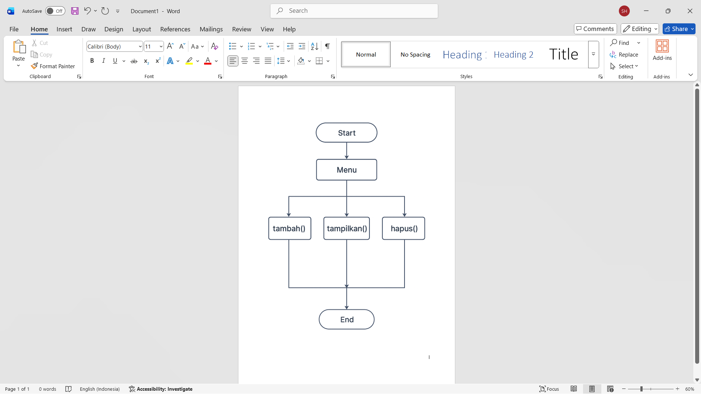
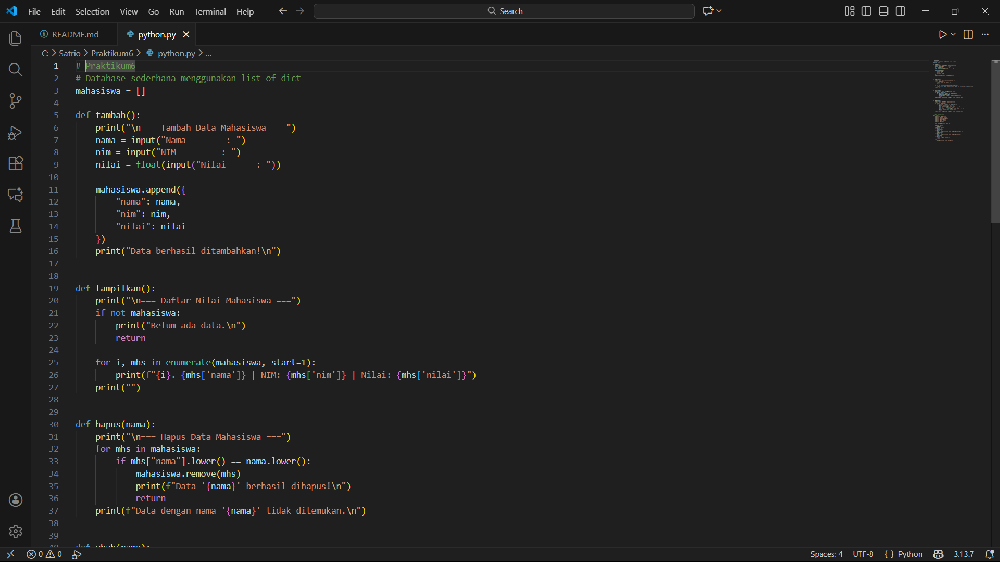

# Praktikum6

## PENJELASAN PROGRAM

Program ini dibuat untuk mengelola daftar nilai mahasiswa menggunakan empat fungsi utama:

1. Fungsi tambah()

Fungsi ini digunakan untuk menambahkan data mahasiswa baru.

Alurnya:

Program meminta input:

Nama

NIM

Nilai

Data dimasukkan ke list mahasiswa dalam bentuk dictionary:

{"nama": nama, "nim": nim, "nilai": nilai}

Program menampilkan pesan bahwa data berhasil ditambahkan.

2. Fungsi tampilkan()

Digunakan untuk menampilkan seluruh data mahasiswa.

Alurnya:

Mengecek apakah list mahasiswa masih kosong.

Jika kosong → tampilkan pesan "Belum ada data".

Jika ada data → tampilkan semua data dalam format:

1. Nama | NIM: xxx | Nilai: yyy

3. Fungsi hapus(nama)

Digunakan untuk menghapus data berdasarkan nama mahasiswa.

Alurnya:

Program menerima input nama.

Program mencari nama tersebut di list.

Jika ditemukan → data dihapus.

Jika tidak ditemukan → tampilkan pesan “Data tidak ditemukan”.

4. Fungsi ubah(nama)

Digunakan untuk mengubah data mahasiswa berdasarkan nama.

Alurnya:

Program menerima input nama.

Program mencari nama tersebut di list.

Jika ditemukan → program meminta input:

Nama baru

NIM baru

Nilai baru

Program mengganti data lama dengan data yang baru.

Jika tidak ditemukan → tampilkan pesan “Data tidak ditemukan”.

5. Program Utama (Menu)

Program menggunakan looping while True agar menu terus muncul.

Menu berisi:

Tambah data

Tampilkan data

Hapus data

Ubah data

Keluar

Setiap pilihan memanggil fungsi sesuai nomor menu.

Jika pengguna memasukkan input selain 1–5 → program menampilkan “Pilihan tidak valid!”.

## FLOWCHART

## Program

